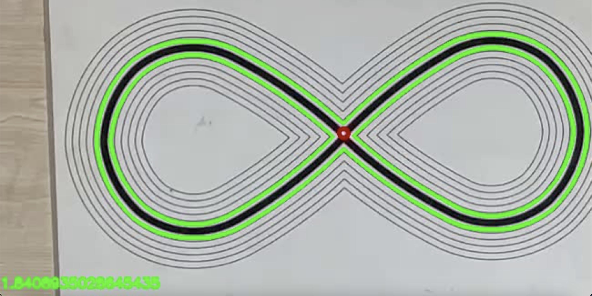

# follow_the_line
This is a project on using image processing to rate the performance of patients under a phase of work-therapy
We have 2 types of patterns with two different colorings, In this project, the patient is asked to keep the red-dot
laser pointer attached to his head on the patterns. 2 types of penalties are applied:
1. The deviation distance from the pattern contour.
2. How long have the patient been outside the line.
3. How many times have the patient crossed the line.

